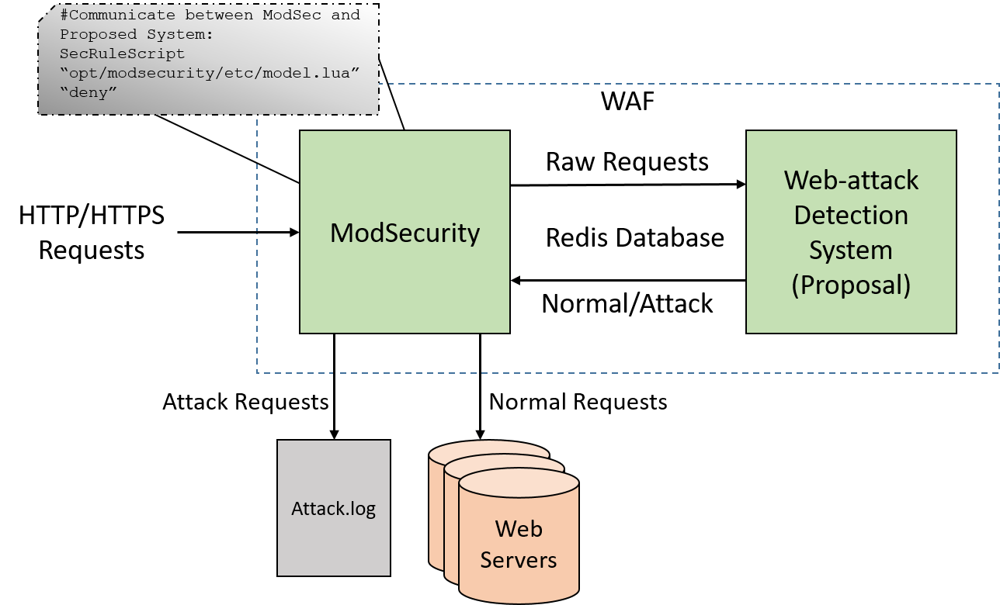

# ModSecurity x Deep Learning Model for Web Attack Detection

## Overall Architecture



## Requirements

### Redis

**Ubuntu**
```sh
sudo apt-get install redis-server
```
**CentOS**
```sh
sudo yum install redis
```

### Python libraries

**Ubuntu**
```sh
sudo apt-get install python3
sudo apt-get -y install python3-pip
sudo pip3 install setuptools
sudo pip3 install redis
sudo pip3 install keras
sudo pip3 install tensorflow
sudo pip3 install pandas
sudo pip3 install transformer==4.30.0
sudo pip3 install torch
```


### Lua Programming Language libraries

**Ubuntu**
```sh
sudo apt-get install lua5.1 liblua5.1-0
sudo apt-get install luarocks
sudo luarocks install redis-lua
sudo luarocks install sha1
```

## Implementation

### git

**Ubuntu**
```sh
sudo apt-get install automake autoconf m4 libtool
sudo apt-get install apache2-dev libxml2-dev
git clone https://github.com/realhugn/ModSec-DAN-deployment.git
cd ModSec-DAN-deployment
```
### Running and configuring Deep Learning Model

**Ubuntu**
```sh
sudo ./config_model.sh
```

### Running and configuring Modsecurity

**Ubuntu**
```sh
sudo ./config_mod.sh
```
## Lưu ý: Thay model đang dùng ở ModSec-DAN-deployment/model/keras_anomaly/lib/unknown_attack_classification.py
